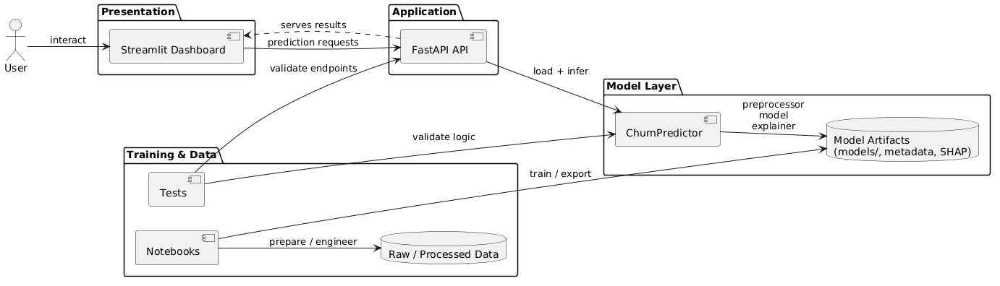

# Customer Churn Prediction

> Predict customer churn probability and explain drivers with SHAP

[](https://github.com/your-org/customer-churn-prediction/actions)
[](https://github.com/your-org/customer-churn-prediction)
[](http://localhost:8501)

## 🎯 Problem Statement

Telecom companies face revenue loss from customers who churn. This project builds an interpretable machine learning pipeline to predict individual customer churn probability and provide per-customer explanations using SHAP to help business teams prioritise retention actions.

## 🏗 Architecture



## 📊 Results
| Metric | Value |
|--------|-------|
| AUC-ROC | 0.861 |
| F1 @ threshold 0.47 | 0.7813 |

> Metrics taken from `models/model_metadata.json`.

## 🚀 Quick Start
```bash
git clone https://github.com/your-org/customer-churn-prediction.git
cd customer-churn-prediction
python -m venv .venv
source .venv/bin/activate   # or .venv\Scripts\Activate.ps1 on Windows
pip install -r requirements.txt
docker compose up --build
```

Notes:
- The project includes both an API service and a Streamlit dashboard. The `docker-compose.yml` orchestrates both services.

## 🔍 API Reference

Base URL: `http://localhost:8000`

- GET `/` — service info (name, version, available endpoints)
- GET `/health` — health & model load status (no auth)
- POST `/predict` — single prediction (requires `Authorization` header)
  - Request body: see example in `api/schemas.py`
  - Response: `churn_probability`, `churn_label`, `risk_tier`, `threshold_used`, `model_version`, `explanation` (SHAP top features)
- POST `/batch` — CSV upload for batch predictions (requires `Authorization` header)
- GET `/metrics` — return stored training metrics (requires `Authorization` header)

Example (single prediction):

```bash
curl -X POST http://localhost:8000/predict \
  -H "Authorization: Bearer <API_KEY>" \
  -H "Content-Type: application/json" \
  -d '{"age":32,"gender":"Female","senior_citizen":0,"has_partner":1,"has_dependents":0,"tenure_months":5,"contract":"Month-to-month","paperless_billing":1,"payment_method":"Electronic check","internet_service":"Fiber optic","online_security":"No","tech_support":"No","streaming_tv":"Yes","monthly_charges":89.5,"total_charges":447.5}'
```

See API Pydantic schemas in `api/schemas.py` for validated request payloads.

## 📁 Project Structure

- `api/` — FastAPI application and prediction logic. Key files:
  - `api/main.py` — API routes and startup lifecycle
  - `api/predictor.py` — `ChurnPredictor` encapsulating model artifacts and prediction pipeline
  - `api/schemas.py` — request/response Pydantic models
- `dashboard/` — Streamlit dashboard and pages
- `models/` — stored model artifacts and `model_metadata.json`
- `data/` — raw and processed datasets used for training and examples
- `notebooks/` — EDA, feature engineering and modeling notebooks
- `tests/` — unit tests for API and prediction logic
- `Dockerfile.api`, `Dockerfile.dashboard`, `docker-compose.yml` — containerization and orchestration

## 🧠 Key Technical Decisions
- Why XGBoost: robust baseline with fast training, native probability estimates, and good performance on tabular data. The trained artifact is `xgboost_v1.pkl`.
- Why SHAP: provides local explanations (per-customer) to make model outputs actionable for business users.
- Threshold selection: an optimal threshold of `0.47` was chosen from the training evaluation to balance precision and recall; see `models/model_metadata.json`.

## 📈 Future Improvements
- Add model retraining pipeline and CI to automatically validate new models and update `model_metadata.json`.
- Add end-to-end tests for the dashboard and API authentication flows.
- Package the API into a Helm chart and add deployment docs for cloud environments.
- Add monitoring and alerting on prediction drift and model performance.

---
